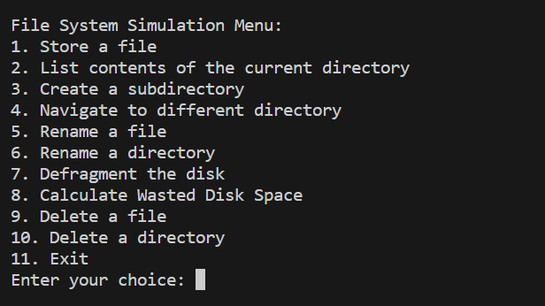

# File System Simulation

A simple yet robust file system simulation in C++ for educational purposes, designed to simulate essential file management operations and provide insights into disk utilization.

## Table of Contents

- [Overview](#overview)
- [Key Features](#key-features)
- [System Requirements](#system-requirements)
- [How to Use](#how-to-use)
- [Screenshots](#screenshots)
- [Contributing](#contributing)

## Overview

File System Simulation is a command-line utility that mimics a file system on a virtual disk. It offers a practical environment to explore file and directory operations, understand disk fragmentation, and evaluate wasted disk space. Whether you're learning about file systems or testing different scenarios, this tool can be a valuable educational resource.

## Key Features

- **File Management:** Create, store, rename, and delete files.
- **Directory Organization:** Organize files into directories and manage subdirectories.
- **Navigation:** Navigate through directories, including moving up to parent directories.
- **Disk Analysis:** Calculate disk fragmentation to assess file layout.
- **Space Efficiency:** Measure wasted disk space for optimizing storage usage.
- **Clean-Up:** Delete files and empty directories with ease.

## System Requirements

To run this project, you'll need the following:

- C++ compiler (e.g., g++)
- Basic knowledge of C++ programming
- A terminal or command prompt

## How to Use

1. Clone this repository to your local machine:

   ```shell
   git clone https://github.com/your-username/file-system-simulation.git

2. Compile the source code:

    ```shell
    g++ main.cpp -o main.exe

3. Run the program:

    ```shell
    ./main.exe


## Screenshot



## Contributing

Contributions to this project are welcome. You can contribute by:


- Forking the repository:

- Creating a new branch for your feature or bug fix
- Making your changes
- Submitting a pull request

Please ensure that your code follows the project's coding standards and is well-documented.